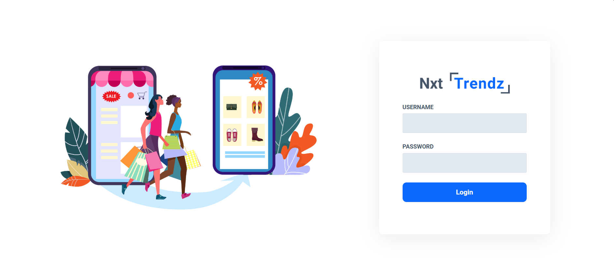
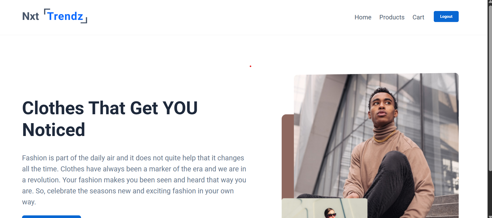
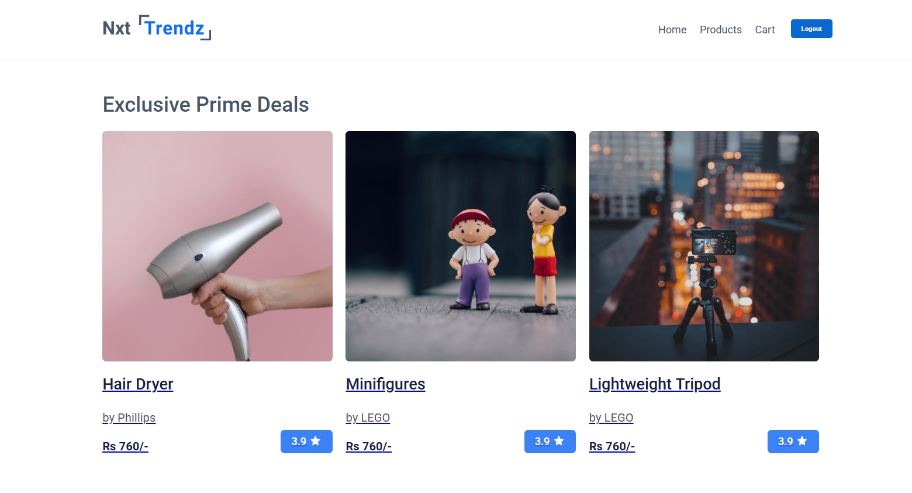
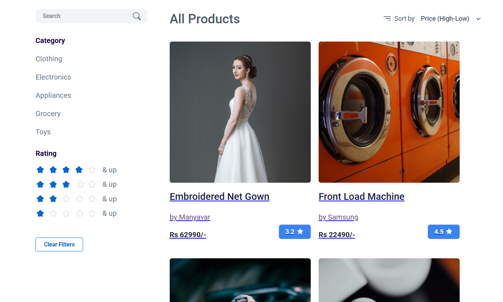
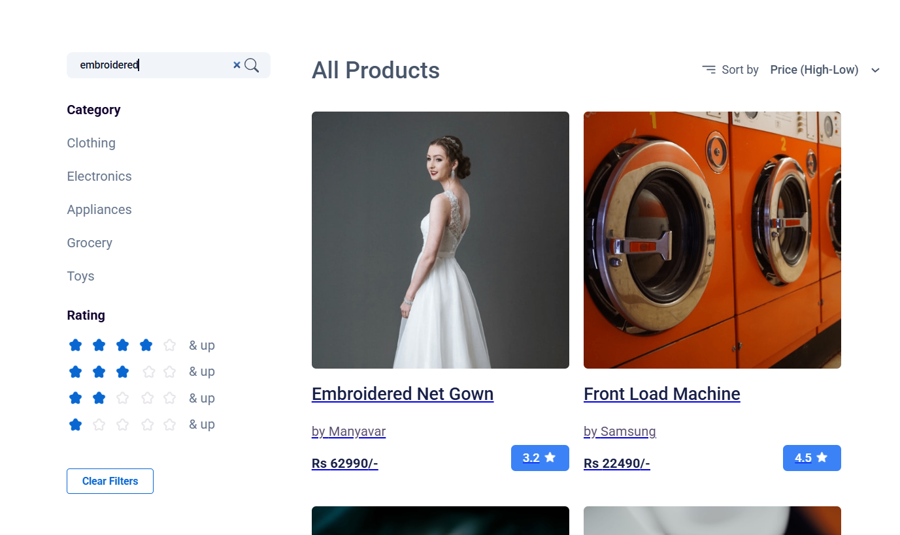
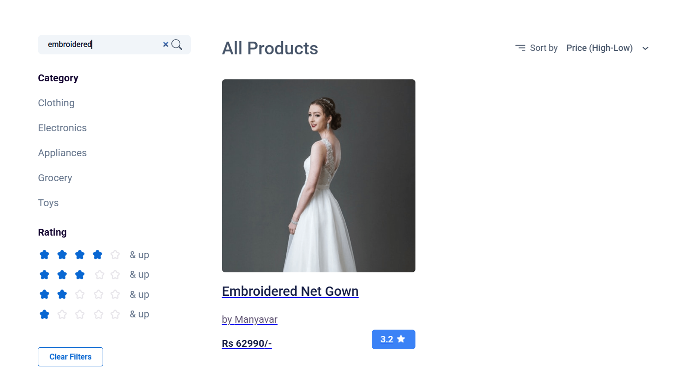
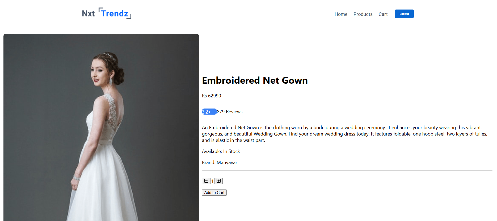
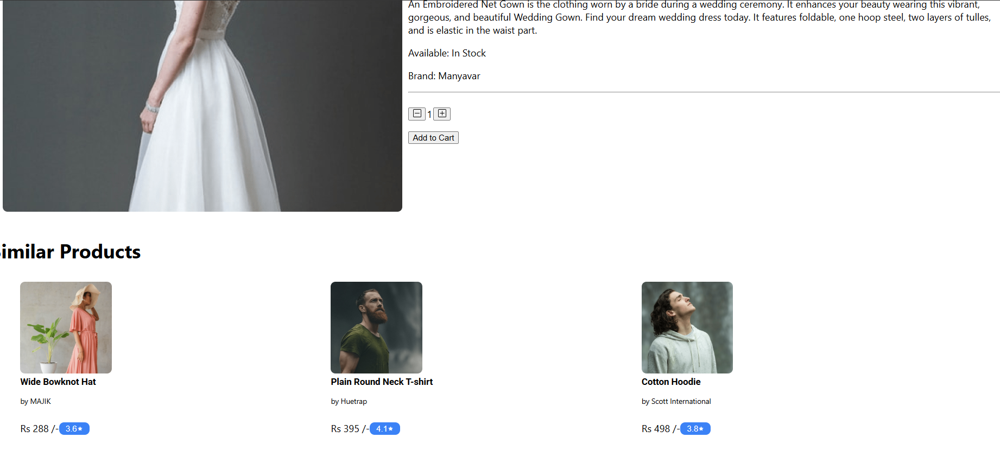
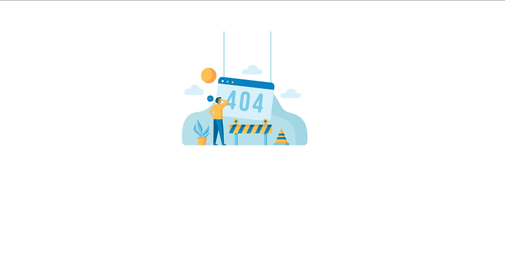
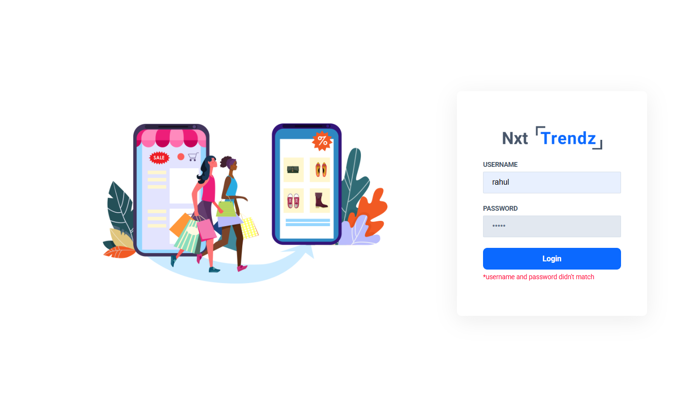

# 🛒 React E-Commerce Application (NxtTrendz Clone)

A fully responsive e-commerce frontend built using **React**, demonstrating production-level concepts such as authentication, protected routes, product listing with filters, dynamic product details, API integration, and clean UI/UX patterns.

This project is part of my React portfolio, designed to showcase real-world component structure and frontend architecture.

---

## 🚀 Live Demo  
(Deploy link will be added soon)

---

## ✨ Features

### 🔐 **User Authentication**
- Login page (`LoginForm`)
- JWT token handling using cookies/localStorage
- Protected routes (`ProtectedRoute`)
- Automatic redirection based on auth status

---

### 🏠 **Home Page**
- Banner section  
- Navigation to products  
- Responsive layout  

---

### 🛍️ **Products Listing (Main Feature)**
Handled under the `Products` component:

- Display all products  
- Search products  
- Sorting options  
- Category filters  
- Rating filters  
- Price range filters  
- Combined filtering logic  
- API loading & error handling  
- Reusable `ProductCard` component  
- Header section for filters (`ProductsHeader`)  
- Dedicated UI for no-results state  

---

### ⭐ **Prime Deals Section**
The `PrimeDealsSection` component displays exclusive items for prime users.

---

### 🔎 **Product Details Page**
The `ProductItemDetails` component includes:

- Large product image  
- Title, brand, price, rating, and reviews  
- Detailed description  
- Similar products section using `SimilarProductItem`  
- API success, failure, and loading UI states  

---

### 🚫 **Not Found Page**
A custom 404 page to handle invalid routes.

---

## 🧰 Tech Stack

- **React**
- **React Router**
- **JavaScript (ES6+)**
- **CSS (Responsive UI)**
- **Fetch API**
- **JWT Authentication**

---

## 📁 Project Structure

```bash
src/
├── components/
│   ├── AllProductsSection/
│   ├── FiltersGroup/
│   ├── Header/
│   ├── Home/
│   ├── LoginForm/
│   ├── NotFound/
│   ├── PrimeDealsSection/
│   ├── ProductCard/
│   ├── ProductItemDetails/
│   ├── Products/
│   ├── ProductsHeader/
│   ├── ProtectedRoute/
│   └── SimilarProductItem/
│
├── App.js
├── App.css
├── index.js
└── setupTests.js

## 📸 Screenshots

### 🔐 Login Page


### 🏠 Home Page


### 🛍️ Products Page



### 🎚️ Filters Section



### 🔎 Specific Product Details Page


###  Similar Products Section


### Not Found Page


### Invalid Credentials

